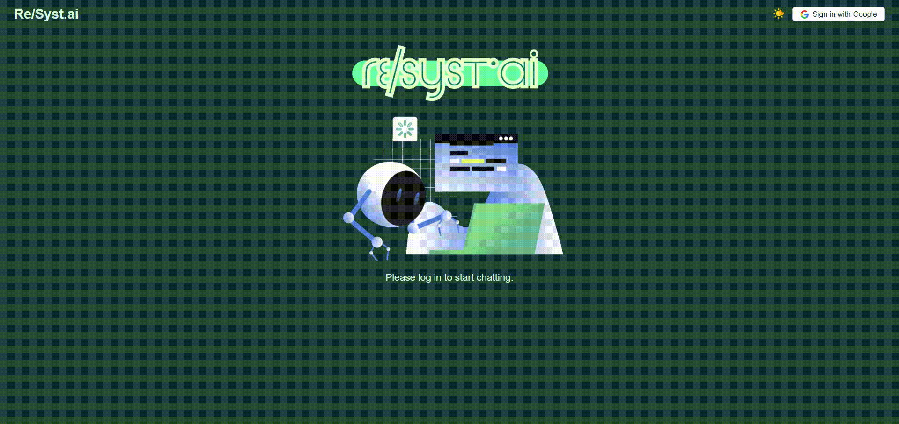
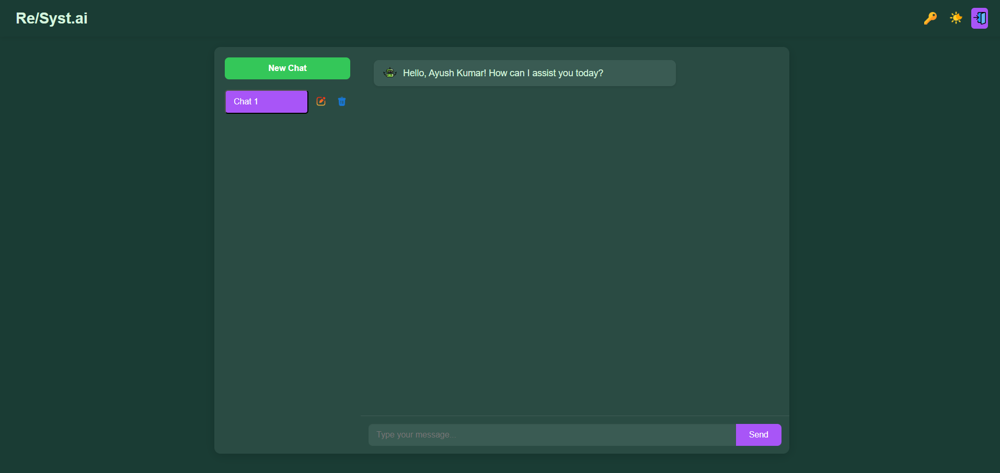
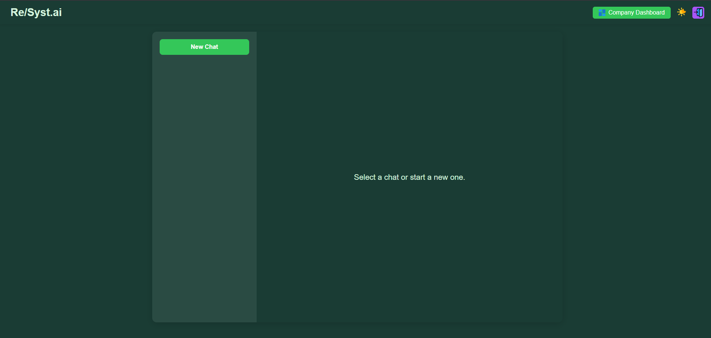
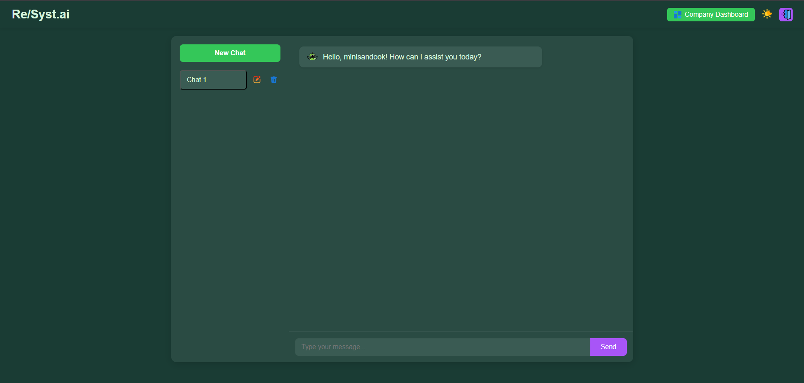
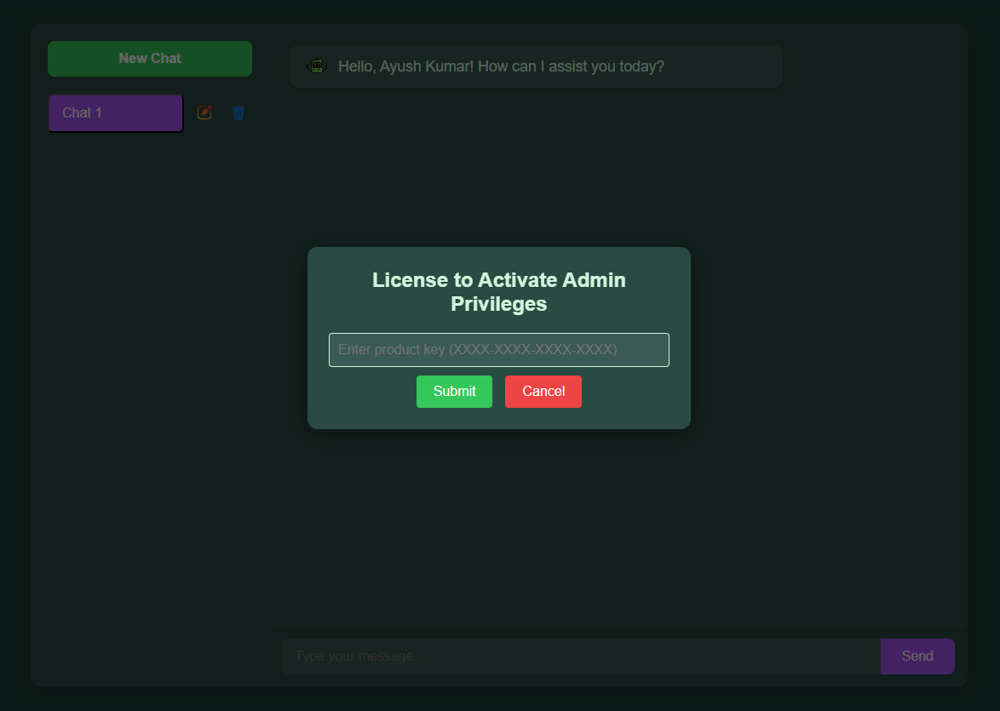
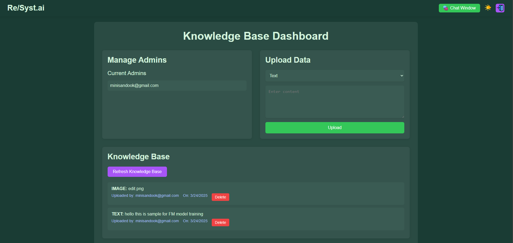

# Re/Syst.ai - RAG Chat UI

Re/Syst.ai is a React-based chat application with a knowledge base dashboard, designed to provide a seamless user experience for chatting and managing company data. It integrates Firebase for authentication, Firestore for data storage, and includes features like chat management, admin privileges, and a knowledge base for uploading and sharing content. The app supports light and dark themes and uses Google authentication for user login.

**Live Demo**: The site is live and can be accessed [HERE](https://resyst-ai-v1.netlify.app).


---

## Aim

The primary aim of Re/Syst.ai is to create a user-friendly Retrieval-Augumented-Generation chat App interface for Companyies where:
- Users can engage in conversations with the App to Undertand FAQs personal to internal working of Organisation.
- Admins can manage a shared knowledge base and other admins.
- Non-admin users can activate admin privileges using predefined product keys.
- The app provides a responsive, theme-switchable UI for an enhanced user experience.
- It provide a chat Ai playground for users to experiment with

---

## Features

- **Chat Management**:
  - Create, edit, and delete chats stored in Firestore under a user-specific collection.
  - Real-time message updates with automatic scrolling to the latest message.
- **Company Dashboard** (Admin Only):
  - Manage admins (view and delete).
  - Upload content to a shared knowledge base (text, URLs, or mocked files).
  - View and delete knowledge base entries with metadata (uploader, timestamp).
- **Authentication**:
  - Google sign-in via Firebase Authentication.
  - Persistent login state using localStorage.
- **Admin Privileges**:
  - Activate admin status using one of five predefined product keys.
  - Admins have access to the company dashboard and knowledge base management.
- **Theming**:
  - Toggle between light and dark themes, saved in localStorage.
- **Responsive Design**:
  - Adapts to various screen sizes with a clean, modern UI.







---

## Project Structure

```
Frontend/
├── src/
│   ├── assets/                # Static assets (icons, images)
│   │   ├── chat.png
│   │   ├── dashboard.png
│   │   ├── day-mode.png
│   │   ├── delete.png
│   │   ├── edit.png
│   │   ├── google-icon.svg
│   │   ├── key.png
│   │   ├── logout.png
│   │   ├── main.gif
│   │   ├── night-mode.png
│   │   ├── unicodebot-icon.svg
│   │   └── user.png
│   ├── components/            # React components
│   │   ├── ChatManager.js     # Manages chat list and selection
│   │   ├── ChatManager.css
│   │   ├── ChatWindow.js      # Displays messages for a selected chat
│   │   ├── ChatWindow.css
│   │   ├── CompanyDashboard.js # Admin dashboard for managing admins and knowledge base
│   │   ├── CompanyDashboard.css
│   │   ├── InputArea.js       # Input field and send button for messages
│   │   ├── InputArea.css
│   │   ├── Message.js         # Displays individual chat messages
│   │   ├── Message.css
│   │   ├── Modal.js           # Reusable modal for confirmations
│   │   └── Modal.css
│   ├── App.js                 # Main app component with routing and auth logic
│   ├── App.css                # Global styles and theme-specific styles
│   ├── firebase.js            # Firebase configuration and exports
│   └── index.js               # Entry point for React app
├── public/                    # Public assets and HTML template
├── package.json               # Project dependencies and scripts
└── README.md                  # Project documentation (this file)
```

---

## Firebase Setup

### Cloud Firestore Collections
- **`admins`**: Stores admin user data (email, UID).
- **`knowledgeBase`**: Shared collection for uploaded content (text, URLs, mocked files).
- **`product-key`**: Contains a single document (`iAD50KN8TdpgcJ7zElBa`) with five product keys (`key1` to `key5`):
  - `AB12-CD34-EF56-GH78`
  - `XY90-ZW87-VU65-TS43`
  - `MN45-PQ67-RS89-TU12`
  - `JK34-LM56-NO78-PQ90`
  - `BC23-DE45-FG67-HI89`
- **`users`**: User-specific data, including nested `chats` collection for chat history.

### Security Rules
The Firestore security rules ensure controlled access to data:
```javascript
rules_version = '2';
service cloud.firestore {
  match /databases/{database}/documents {
    match /users/{userId} {
      allow read: if request.auth != null;
      allow write: if request.auth != null && request.auth.uid == userId;
    }
    match /users/{userId}/chats/{chatId}/{document=**} {
      allow read, write: if request.auth != null && request.auth.uid == userId;
    }
    match /companyData/{companyId}/{document=**} {
      allow read, write: if request.auth != null && exists(/databases/$(database)/documents/admins/$(request.auth.uid));
    }
    match /admins/{adminId} {
      allow read: if request.auth != null;
      allow write: if request.auth != null;
    }
    match /knowledgeBase/{uploadId} {
      allow read, write: if request.auth != null && exists(/databases/$(database)/documents/admins/$(request.auth.uid));
    }
    match /product-key/{docId} {
      allow read: if request.auth != null;
      allow write: if false;
    }
    match /{document=**} {
      allow read, write: if false;
    }
  }
}
```

### Authentication
- **Provider**: Google Authentication via Firebase.
- **Config**: Defined in `firebase.js` with the project’s credentials.

---

## How It Works

1. **User Authentication**:
   - Users sign in with Google, and their session is stored in localStorage.
   - The app checks if the user is an admin by querying the `admins` collection.

2. **Chat Interface**:
   - Non-admins and admins can create, edit, and delete chats stored in `users/{userId}/chats`.
   - Messages are stored in a nested `messages` subcollection and updated in real-time.

3. **Admin Activation**:
   - Non-admins can enter a product key (from `product-key/iAD50KN8TdpgcJ7zElBa`) to gain admin status.
   - Valid keys are checked, and the user’s email and UID are added to the `admins` collection.

4. **Company Dashboard** (Admin Only):
   - Admins can view and delete other admins (except themselves).
   - Upload content (text, URLs, or mocked files) to the `knowledgeBase` collection.
   - View and delete existing knowledge base entries with metadata.

5. **Theming**:
   - Toggle between light and dark themes, with the preference saved in localStorage.

---

## Prerequisites

- **Node.js**: Version 14.x or higher.
- **npm**: Version 6.x or higher.
- **Firebase Account**: With a project set up for Authentication, Firestore, and (optionally) Storage.

---

## Steps to Run Locally

1. **Clone the Repository**:
   ```bash
   git clone https://github.com/your-username/rag-chat-ui.git
   cd rag-chat-ui
   ```

2. **Install Dependencies**:
   ```bash
   npm install
   ```

3. **Set Up Firebase**:
   - Create a Firebase project at [console.firebase.google.com](https://console.firebase.google.com).
   - Enable Google Authentication in the Authentication section.
   - Enable Firestore and set up the following collections:
     - `admins`: Add admin documents as needed.
     - `knowledgeBase`: Initially empty; populated via the dashboard.
     - `product-key`: Add a document with ID `iAD50KN8TdpgcJ7zElBa` and fields `key1` to `key5` with the provided keys.
     - `users`: Automatically created per user on first chat.
   - Update `src/firebase.js` with your Firebase configuration:
     ```js
     const firebaseConfig = {
       apiKey: "your-api-key",
       authDomain: "your-auth-domain",
       projectId: "your-project-id",
       storageBucket: "your-storage-bucket",
       messagingSenderId: "your-messaging-sender-id",
       appId: "your-app-id",
       measurementId: "your-measurement-id",
     };
     ```

4. **Run the Application**:
   ```bash
   npm start
   ```
   - The app will open in your browser at `http://localhost:3000`.

5. **Test the App**:
   - Sign in with Google.
   - Create chats as a regular user.
   - Use a product key (e.g., `AB12-CD34-EF56-GH78`) to activate admin privileges.
   - Access the company dashboard to manage admins and the knowledge base.

---

## Dependencies

- `react`: ^18.x - Core library for building the UI.
- `firebase`: ^9.x - For authentication, Firestore, and (mocked) Storage.
- `react-dom`: ^18.x - For rendering React components.

Install them via:
```bash
npm install react firebase react-dom
```

---

## Notes

- **File Uploads**: Currently mocked in Firestore with file names. For production, integrate Firebase Storage to store actual files and save URLs in Firestore.
- **Chatbot**: The AI responses are static greetings. Integrate a backend (e.g., DeepSeek API) for dynamic responses.
- **Security**: Ensure Firebase security rules are tested thoroughly in production.

---

## Contributing

Feel free to fork this repository, submit issues, or create pull requests to enhance the project!

---

## License

This project is licensed under the MIT License.
```

---

### Explanation of the `README.md`

1. **Project Overview**:
   - Describes Re/Syst.ai as a chat and dashboard app with Firebase integration.

2. **Aim**:
   - Outlines the purpose of providing a chat interface and admin tools.

3. **Features**:
   - Lists key functionalities like chat management, admin dashboard, authentication, and theming.

4. **Project Structure**:
   - Details the file structure based on the provided components and assets.

5. **Firebase Setup**:
   - Documents the Firestore collections, security rules, product keys, and Google authentication setup.

6. **How It Works**:
   - Explains the app’s workflow from authentication to chat and admin features.

7. **Steps to Run**:
   - Provides clear instructions to clone, install, configure Firebase, and run the app locally.

8. **Dependencies**:
   - Lists the main npm packages required.

9. **Notes**:
   - Highlights areas for improvement (e.g., file uploads, chatbot integration).

---
